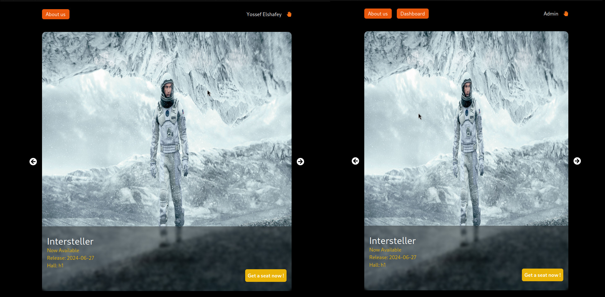

# Cinema System

Cinema reservation app include users / admin

<div align="center">
    
    
    
</div>

## Installaion

To get the fronend/backend working properly check <a href="https://github.com/Yossef-Elshafey/tickets-api">API</a>

<h2 style="border-bottom: 0.5px solid red; padding:0; margin-bottom:20px;"></h2>

```
git clone https://github.com/Yossef-Elshafey/cinema-app
```

```
cd cinema-app
```

Read A book until npm finishs (don't rush)

```
npm install
```

```
npm start
```
